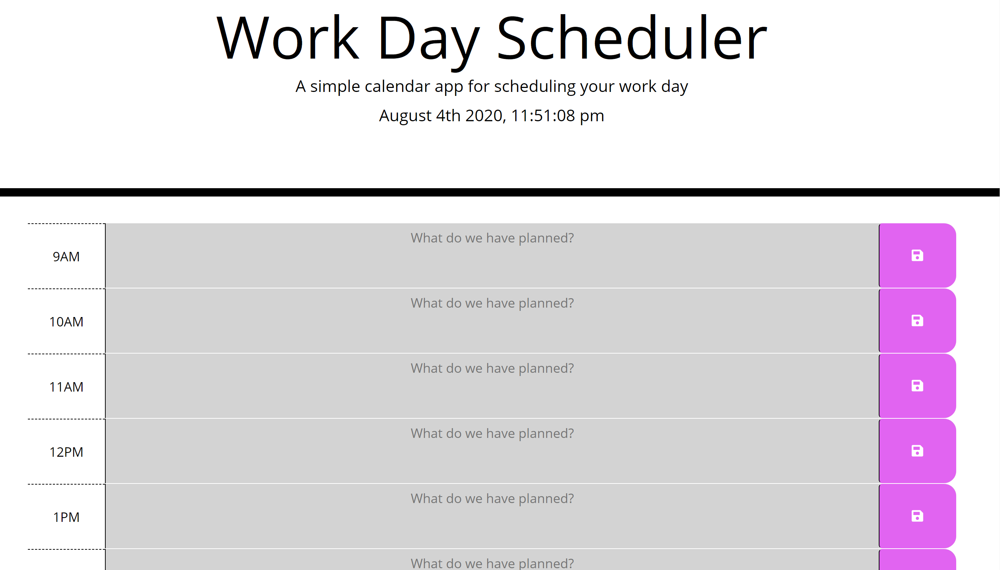

# Daily_Planner

## Summary:
* Here is a simple browser-run calender for managing one's daily itinerary during standard 9am-6pm business hours. This application is powered by jQuery, HTML, and CSS.

## Instructions:
* Click the desired time block.
* Type in the task or event for that slot.
* Click the save button.

## Features:
* Time slots are color coded:
    * Grey idicates time slots that are past the current time.
    * Red indicates time slot for the present time.
    * Green indicates slots in the future.
* User is able to clear any saved entries by clicking the clear button at the bottom of the page.

## Links:
[Schedule Your Day](https://andal-a.github.io/Daily_Planner/)
